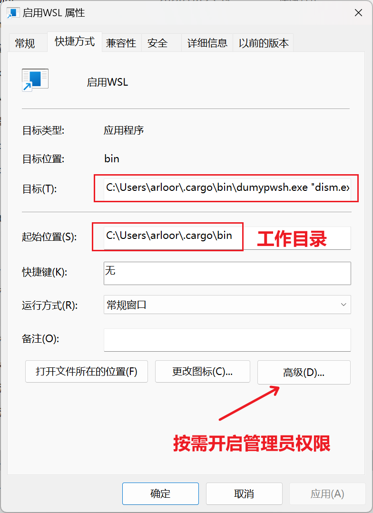
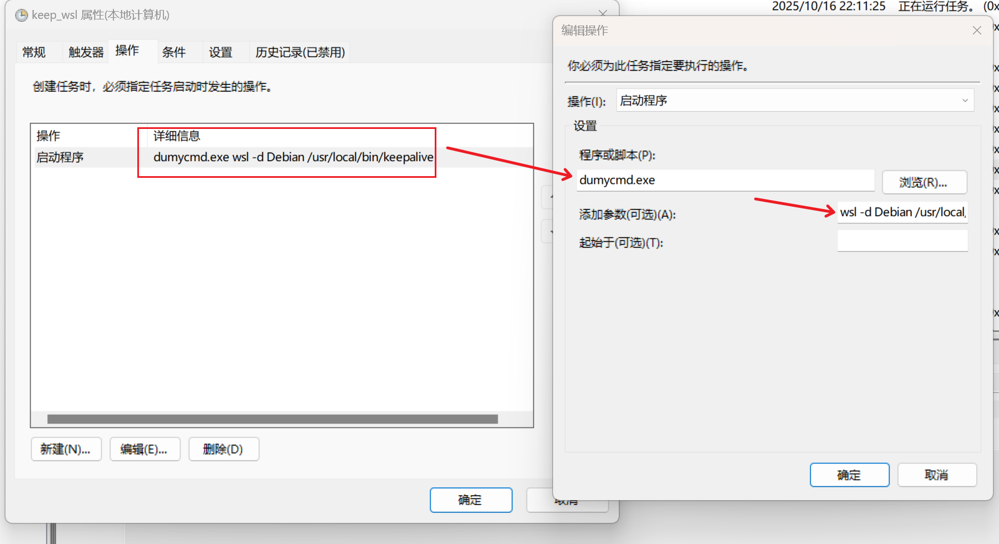

# Dumy

一个用于在后台静默执行 Windows 命令的工具程序。

有两个可执行文件，分别是 `dumycmd.exe` 和 `dumypwsh.exe`，前者用于执行传统的 cmd 命令，后者用于执行 PowerShell 命令。

均可以做到完全隐藏 windows 控制台窗口，可以替换以下传统的 VBS 脚本：

```powershell
Set WshShell = CreateObject("WScript.Shell")
WshShell.Run "sslocal --local-addr xxxxxx -k xxxxx -v -m aes-256-gcm -s xxxxxxx", 0
```

特别适合用于在 Windows 的自启动或任务计划程序中执行命令，直接设置为下面的命令即可

```bash
dumycmd.exe sslocal --local-addr xxxxxx -k xxxxx -v -m aes-256-gcm -s xxxxxxx
```

## 测试

```powershell
cargo run --bin dumycmd -- netsh interface ipv6 show global
cargo run --bin dumycmd -- mkdir "a b"
cargo run --bin dumypwsh -- "Get-netIPV4Protocol;Get-netIPV6Protocol"
# 将ipv6地址改成slaac分配
cargo run --bin dumypwsh -- "Set-NetIPv6Protocol -UseTemporaryAddresses Disabled;Set-NetIPv6Protocol -RandomizeIdentifiers Disabled;Get-NetIPv6Protocol;Restart-NetAdapter -Name '以太网 6'"
cargo run --bin dumypwsh -- Get-netIPV4Protocol
cargo run --bin dumypwsh -- "mkdir 'a b c'"
```

## 安装

```bash
cargo install --path . --features no-console --bin dumycmd
cargo install --path . --features no-console --bin dumypwsh
```

## 日志文件

如果在执行命令时遇到问题，可以查看日志文件 `dumy.log`，该文件位于当前工作目录下。

## 快捷方式



| 起始位置下的 log 目录中存放日志文件

可以代替 powershell 的快捷程序，来达成隐藏窗口，并且突破程序最长 260 个字符的限制，例如：

```pwsh
C:\Windows\System32\WindowsPowerShell\v1.0\powershell.exe -ExecutionPolicy Bypass -Command "Stop-VM -Name 'rhel9'"
```

## 任务计划程序使用



| 起始位置下的 log 目录中存放日志文件

## 参考文档：

[Process Creation Flags](https://learn.microsoft.com/en-us/windows/win32/procthread/process-creation-flags)
